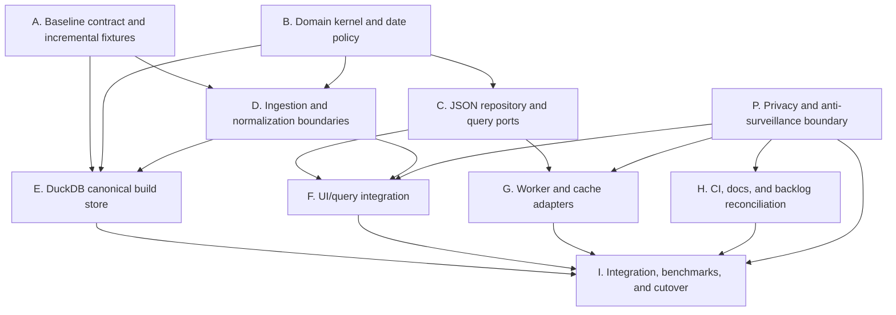

# Zivv Reorganization Plan for Parallel Agents

**Plan branch:** `codex/reorg-parallel-plan`  
**Base:** `codex/repo-architecture-analysis` at the current repository baseline  
**Status:** execution plan; no application reorganization has been performed by this document  
**Primary goal:** separate domain logic, ingestion, storage, query use-cases, UI state, and rendering while making DuckDB the canonical build-time store and preserving static JSON delivery initially.

## 1. Operating decision

The reorganization will be executed as a sequence of independently reviewable workstreams. Agents may work in parallel only when their ownership boundaries and dependency gates in this document permit it.

The target architecture is:

```text
raw source + curation
        |
        v
source ingestion -> normalization/identity resolution
        |
        v
canonical domain records
        |
        +--------------------------+
        |                          |
        v                          v
DuckDB build store          static read-model export
        |                          |
        +------------+-------------+
                     v
              repository/query ports
                     |
                     v
              React app + UI state
```

DuckDB is the build-time canonical store in the first target state. The web app continues to consume versioned static JSON read models until a separate benchmark proves that DuckDB-Wasm or an API is warranted.

## Cross-cutting privacy and anti-surveillance charter

Privacy is a product invariant, not an optional feature. Zivv must be designed against surveillance capitalism: the application must not turn a person's searches, filters, navigation, reading, or event interest into a server-side behavioral record.

### 2.1 Non-negotiable application rules

- No accounts, login, authentication, user profiles, or user-identifying cookies.
- No analytics, advertising, telemetry, session replay, fingerprinting, third-party tracking pixels, or remote error-reporting service.
- No browser-to-server `POST`, `PUT`, `PATCH`, `DELETE`, `sendBeacon`, WebSocket, or equivalent event-reporting channel for user actions.
- Application data requests are same-origin, static, read-only asset requests. They must not include search text, selected filters, route history, click events, or generated user IDs.
- Errors and performance measurements remain local to the browser and developer console. They must never be uploaded automatically.
- IndexedDB and `localStorage` may hold only explicitly documented, non-identifying preferences/cache data. They are not user profiles and must not be synced.
- Outbound ticket, venue, GitHub, and email links must use an explicit no-referrer policy where supported and must not append Zivv-specific user state.
- Search and filter state must not be placed in the HTTP query string. If shareable state is retained, use URL fragments or another client-only representation so the state is not sent to the static host on reload.

### 2.2 Honest boundary of the promise

The UI may promise that Zivv does not send application-level user actions or identifiers to a server. It must not claim that ordinary network metadata is impossible: loading a static site necessarily exposes transport metadata such as an IP address, timestamp, and user agent to the hosting/network layer. Zivv will not add another application-level record of that activity and will document this distinction plainly.

### 2.3 Required UI language

The About/privacy surface must visibly state:

> Zivv is against surveillance capitalism. No account is required. Searches, filters, browsing, and reading choices stay in your browser; Zivv does not send them to us for tracking, profiling, advertising, or analytics.

It must also link to a technical privacy explanation covering local storage, static asset requests, outbound links, and the hosting-metadata boundary. Avoid vague claims such as “no digital footprint” when the claim cannot be guaranteed at the network layer.

### 2.4 Privacy test gate

The reorganization is not ready to merge until automated tests and a manual browser audit show that:

- no third-party script, analytics SDK, tracking pixel, auth provider, or remote error reporter is loaded by the production app;
- no user action causes an application-level request beyond the allowlisted same-origin static reads;
- search and filter actions do not add user state to `window.location.search`;
- cold and warm cache behavior is equivalent without sending cache contents or action history anywhere;
- error handling, worker messages, and debug metrics remain local;
- outbound links have `rel="noreferrer"` or an equivalent enforced referrer policy;
- the visible privacy statement matches the actual network behavior.

The seven committed snapshots in `data/steve/` are the incremental ingestion test sequence:

1. `week-251010.txt`
2. `week-251024.txt`
3. `week-260109.txt`
4. `week-260417.txt`
5. `week-260424.txt`
6. `week-260508.txt`
7. `week-260807.txt`

These files are historical source snapshots, not weekly partitions. They must remain unchanged and must be used to test repeated ingestion, deduplication, identity stability, source provenance, and generated-output deltas.

## 2. Rules for parallel work

### 2.1 Branching

All work starts from the plan branch or from the latest integration branch created from it. Suggested names:

```text
codex/reorg-baseline-contract
codex/reorg-domain-kernel
codex/reorg-json-repository
codex/reorg-ingestion
codex/reorg-duckdb-store
codex/reorg-ui-query-integration
codex/reorg-worker-cache
codex/reorg-docs-ci
codex/reorg-integration-wave-1
```

Agents must not commit directly to `main`. The coordinator merges workstream branches in dependency order.

### 2.2 Ownership

Each workstream owns the files listed in its scope. An agent must not make opportunistic edits in another workstream’s files. If a change crosses a boundary, create a handoff note or a small follow-up task rather than editing the other surface.

In particular:

- only the contract agent changes manifest/export contract tests until the DuckDB exporter is ready;
- only the domain agent owns new domain types and value objects;
- only the JSON repository agent owns the JSON adapter;
- only the DuckDB agent owns DuckDB schema and driver integration;
- only the UI integration agent changes pages/stores to consume query use-cases;
- only the worker/cache agent changes worker and cache behavior;
- docs/roadmap updates are consolidated by the docs/CI agent after implementation decisions settle.

### 2.3 Commit discipline

Use one concern per commit. Recommended prefixes:

```text
reorg(contract): ...
reorg(domain): ...
reorg(json): ...
reorg(ingestion): ...
reorg(duckdb): ...
reorg(ui): ...
reorg(worker): ...
reorg(docs): ...
test(reorg): ...
```

Every workstream handoff must include:

- branch and commit hash;
- files changed;
- tests run and results;
- known limitations;
- any requested follow-up;
- whether the branch is safe to merge.

### 2.4 Integration policy

The coordinator merges in small waves, runs the relevant quality gates, and creates an integration branch before broad UI changes.

No agent should:

- rewrite all of `src/` in one branch;
- remove the JSON export before the replacement passes contract tests;
- add DuckDB-Wasm before the client-store benchmark;
- change generated production data merely to make a test pass;
- rename the seven `data/steve` fixtures;
- modify unrelated Beads issues as part of a code change.

## 3. Dependency graph



The first useful parallel wave is `A + B + H + P`. The second is `C + D`. DuckDB work begins after the baseline contract and domain boundaries exist. UI migration begins only after a repository/query port and privacy boundary are available.

## 4. Workstream A — baseline data contract and incremental fixtures

**Suggested branch:** `codex/reorg-baseline-contract`  
**Priority:** first  
**Dependencies:** none  
**May run in parallel with:** B and H  
**Primary purpose:** establish the tests that prevent the reorganization from changing data semantics accidentally.

### Scope

Own:

- new tests under `src/test/data-contract/` or `tests/data-contract/`;
- fixture-loading helpers that read `data/steve/week-*.txt`;
- manifest/export validation helpers;
- narrowly scoped changes to `src/types/data.ts` if required to represent corrected metadata;
- no broad ETL refactor.

Do not own:

- DuckDB schema;
- page components;
- repository adapters;
- changing the seven source snapshots.

### Tasks

1. Add a fixture manifest describing the seven snapshots in chronological order.
2. Add a source snapshot loader that returns raw text, source date, filename, and expected predecessor.
3. Add tests for chronological ordering and stable fixture discovery.
4. Add generated-output contract tests that verify:
   - every manifest-referenced file exists;
   - actual byte size equals manifest byte size;
   - checksum matches the declared algorithm;
   - record counts match;
   - event chunk counts and date ranges match;
   - every event venue exists;
   - every event artist exists;
   - no event appears in two month chunks;
   - all IDs referenced by projections resolve.
5. Add a test harness for sequential ingestion:
   - ingest snapshot 1 into an empty target;
   - ingest snapshots 2–7 in order;
   - assert no unexpected loss of stable records;
   - assert additions/updates are reported;
   - assert re-ingesting the same snapshot is idempotent.
6. Define test reporting for added, updated, removed, unchanged, malformed, and deduplicated source records.

### Acceptance criteria

- The seven snapshots are discovered without hard-coding seven separate test cases.
- The tests fail against the current manifest size/index metadata defect, or the contract is updated in a separate approved commit that fixes it.
- Sequential ingestion has deterministic results.
- The test output identifies which snapshot and source line caused a failure.
- No production UI code is changed.

### Handoff

Deliver a reusable fixture API and a failing/green contract suite. Report the exact current failures before any agent fixes production code.

## 5. Workstream B — domain kernel and date policy

**Suggested branch:** `codex/reorg-domain-kernel`  
**Priority:** first  
**Dependencies:** none  
**May run in parallel with:** A and H  
**Primary purpose:** create storage- and UI-independent domain types and pure business rules.

### Scope

Create:

```text
src/domain/
  entities.ts
  identifiers.ts
  filters.ts
  dates.ts
  prices.ts
  normalization.ts
  projections.ts
  repository.ts
  errors.ts
  index.ts
src/domain/__tests__/
```

Initially, these may re-export or wrap existing types. Do not migrate every import in this workstream.

### Tasks

1. Define canonical domain entities:
   - Event;
   - Artist;
   - Venue;
   - event/artist relationship;
   - event tags/status;
   - source provenance.
2. Separate canonical records from projections:
   - event summary;
   - event detail;
   - artist summary/detail;
   - venue summary/detail;
   - search document.
3. Define branded identifiers and stable keys.
4. Define filter/query input types independent of Zustand.
5. Define date-only and timestamp policy:
   - event date is a local calendar date in the event timezone;
   - start time is an instant when known;
   - date-range comparisons use the event timezone;
   - missing start time is not silently converted to midnight.
6. Move city normalization, age matching, price matching, tag matching, and free-event semantics into pure functions.
7. Define repository ports and typed pagination.
8. Add unit tests for edge cases, especially DST boundaries, free prices, ranges, aliases, and multi-artist billing.

### Acceptance criteria

- No domain module imports React, Vite, Zustand, IndexedDB, Node filesystem APIs, or DuckDB.
- Domain tests run without a browser environment.
- Existing frontend types can be migrated incrementally.
- Stable keys are distinct from display IDs and slugs.
- The repository interface supports event-by-ID, slug lookup, listing, search, monthly listing, and detail projections.

### Handoff

Provide a short mapping from old types in `src/types/` to new domain types. Do not delete old types until downstream adapters have migrated.

## 6. Workstream C — JSON repository and query ports

**Suggested branch:** `codex/reorg-json-repository`  
**Priority:** second wave  
**Dependencies:** B; A recommended  
**May run in parallel with:** D  
**Primary purpose:** make the current static JSON dataset conform to the new query boundary before introducing DuckDB.

### Scope

Own:

```text
src/data/
  ports.ts
  json/
    JsonDatasetReader.ts
    JsonEventRepository.ts
    JsonArtistRepository.ts
    JsonVenueRepository.ts
    JsonQueryRepository.ts
  cache/
    CachePort.ts
    IndexedDbCacheAdapter.ts
src/data/__tests__/
```

Existing `DataService.ts` and `CacheService.ts` may be wrapped, but avoid a wholesale rewrite until behavior is covered.

### Tasks

1. Define a dataset reader that loads manifest/core files and month chunks.
2. Use manifest chunk metadata to locate a month before loading it.
3. Add explicit slug and event-ID location support.
4. Implement complete cold-start search:
   - search index identifies matching entities/events;
   - result chunk IDs are resolved without consulting only in-memory events;
   - required chunks are loaded;
   - results are joined into summaries.
5. Implement event, artist, and venue list/detail queries.
6. Put filtering/sorting/pagination in one query module.
7. Keep IndexedDB behind a cache port.
8. Add adapter contract tests using the seven source snapshots plus current generated output.
9. Add instrumentation for cache hit/miss, chunks loaded, bytes read, and query duration.

### Acceptance criteria

- A deep link resolves with an empty cache without scanning every month.
- A search performed before any event chunk is loaded returns complete matching results.
- The same query returns the same ordering and pagination for cold and warm cache.
- Page code does not need to know filenames or chunk location rules.
- Existing public JSON filenames remain supported.

### Handoff

Provide the repository factory/API that the UI agent can consume. Any required changes to the generated data contract must be handed to A/D rather than silently embedded in the adapter.

## 7. Workstream D — ingestion and normalization boundaries

**Suggested branch:** `codex/reorg-ingestion`  
**Priority:** second wave  
**Dependencies:** A recommended; B required  
**May run in parallel with:** C  
**Primary purpose:** split source parsing, normalization, identity resolution, derivation, and export preparation.

### Scope

Refactor under:

```text
src/lib/etl/
  source/
  normalization/
  identity/
  derivations/
  projections/
  export/
  pipeline/
```

Keep the existing parser behavior initially. This is a separation/refactor, not permission to change data semantics without fixtures.

### Tasks

1. Separate raw source parsing from normalized entity construction.
2. Make identity resolution explicit for artists and venues.
3. Make dedupe stable-key based and independently testable.
4. Preserve source line, raw text, first-seen, and last-seen provenance.
5. Remove embedded upcoming-event arrays from canonical entity construction.
6. Generate upcoming counts and directory arrays as projections.
7. Move index/chunk/search generation behind exporter interfaces.
8. Consolidate `update-data.js` and `merge-latest.js` responsibilities into named pipeline operations.
9. Make the pipeline accept an input/output configuration so the seven snapshots can be used without mutating production `data/`.
10. Ensure repeated processing of the same snapshot is idempotent.

### Acceptance criteria

- The pipeline has visible stages with typed inputs/outputs.
- Pure normalization can be tested without filesystem writes.
- Canonical entities do not contain time-dependent embedded event lists.
- Existing generated output can be reproduced within approved semantic differences.
- The incremental fixture sequence identifies additions, updates, and deduplication.

### Handoff

Publish a canonical normalized intermediate model and an exporter input model for the DuckDB agent. Do not make the DuckDB package a dependency in this branch.

## 8. Workstream E — DuckDB canonical build store

**Suggested branch:** `codex/reorg-duckdb-store`  
**Priority:** third wave  
**Dependencies:** A, B, D  
**May run in parallel with:** F preparation, G preparation  
**Primary purpose:** establish DuckDB as a reproducible build-time store and export source.

### Scope

Create:

```text
src/lib/store/duckdb/
  schema.sql
  migrations/
  connection.ts
  staging.ts
  canonical.ts
  projections.ts
  repository.ts
  export.ts
scripts/
  duckdb-build.ts
  duckdb-inspect.ts
data/
  .gitkeep or documented generated location
tests/duckdb/
```

Use `@duckdb/node-api` only after confirming the supported Node/Windows/Linux CI matrix. Keep the generated database file out of Git unless a later decision explicitly makes it a release artifact.

### Tasks

1. Add schema versioning independent of dataset versioning.
2. Add ingestion-run metadata.
3. Add raw source/staging tables.
4. Add canonical artist, alias, venue, event, event-artists, and event-tags tables.
5. Add stable keys and uniqueness constraints.
6. Load the normalized intermediate model from D.
7. Add SQL quality checks:
   - duplicate stable keys;
   - missing relationships;
   - invalid date ranges;
   - invalid prices/statuses;
   - orphan artists/venues;
   - duplicate event/artist relations.
8. Add SQL projections for current JSON read models.
9. Export exact bytes first, then compute size/checksum metadata from those bytes.
10. Compare DuckDB export against the current generated data by stable key.
11. Run the seven snapshots sequentially and record row-level deltas.

### Acceptance criteria

- Empty database plus snapshot 1 produces a valid canonical dataset.
- Snapshots 2–7 can be applied in order without duplicate stable records.
- Reapplying any snapshot is idempotent.
- SQL quality checks fail the build on referential or identity errors.
- Exported JSON passes the contract suite from A.
- No browser bundle imports DuckDB.

### Handoff

Provide a build command, schema/version documentation, export command, delta report, and a migration/cutover note. The browser adapter remains JSON until I/F approve a separate client decision.

## 9. Workstream F — UI/query integration

**Suggested branch:** `codex/reorg-ui-query-integration`  
**Priority:** third wave  
**Dependencies:** B, C, D; E export compatibility recommended  
**May run in parallel with:** E after repository contracts are stable  
**Primary purpose:** remove data/query logic from pages and eliminate the duplicate entity graph in Zustand.

### Scope

Own:

```text
src/app/
src/hooks/
src/stores/
src/pages/
src/components/
```

Coordinate before touching shared type barrels or services owned by C/G.

### Tasks

1. Introduce a repository/query provider at app initialization.
2. Reduce `appStore` to:
   - UI state;
   - query status;
   - selected IDs/slugs;
   - cache/refresh commands.
3. Remove duplicated `Map<EventId, Event>`, artist maps, and venue maps when query adapters can provide results.
4. Move page-local filtering/sorting/date parsing into query use-cases.
5. Replace page-local city normalization with the domain policy.
6. Convert detail pages to repository slug/ID queries.
7. Keep route-level loading/error behavior.
8. Preserve URL filter synchronization.
9. Keep UI view models small and card-oriented.
10. Add regression tests for Home, Calendar, Artists, Venues, and detail routes.

### Acceptance criteria

- Pages do not fetch raw JSON or know chunk filenames.
- Pages do not implement independent city/date/price matching rules.
- Event detail deep links work from an empty cache.
- Search and filters behave consistently across list/calendar/directory surfaces.
- Existing URL routes and persisted UI preferences remain compatible.
- Memory use no longer contains two full copies of the same entity graph.

### Handoff

Provide a list of intentionally changed UX behaviors and any deferred page migration. Do not mix i18n, FullCalendar, signage, or poster work into this stream.

## 10. Workstream G — worker and cache boundary

**Suggested branch:** `codex/reorg-worker-cache`  
**Priority:** third wave  
**Dependencies:** B and C  
**May run in parallel with:** E and F  
**Primary purpose:** make browser acceleration optional and keep browser storage replaceable.

### Decision gate

Before implementing, benchmark whether current dataset size benefits from a worker. The likely first result is that query correctness matters more than worker parallelism. The agent must recommend one of:

1. remove unused worker query paths;
2. keep a small worker for parsing/large result transforms;
3. move query execution into DuckDB-Wasm later;
4. retain the worker only behind the repository/query interface.

### Tasks

1. Put cache behavior behind the cache port from C.
2. Repair or remove incomplete worker methods.
3. If retained, pass all required context explicitly, including venues/artists for filtering/search.
4. Make main-thread fallback semantically equivalent to worker behavior.
5. Add cancellation, timeout, and disposal tests.
6. Measure worker transfer overhead for the seven incremental datasets.
7. Ensure cache version invalidation is based on dataset/schema version together.

### Acceptance criteria

- Worker and fallback produce identical results for the contract suite.
- No worker method silently returns incomplete results.
- Cache failures degrade to network/static reads where safe.
- Refresh/dispose does not leave pending requests or stale data.
- The recommendation is documented if worker functionality is reduced.

## 11. Workstream H — CI, documentation, and backlog reconciliation

**Suggested branch:** `codex/reorg-docs-ci`  
**Priority:** first wave for read-only analysis; implementation after A–E decisions  
**Dependencies:** none for inventory; A/E for final CI changes  
**May run in parallel with:** A and B  
**Primary purpose:** keep the project plan, CI, and issue backlog aligned with the actual architecture.

### Tasks

1. Add an ADR for:
   - DuckDB build-time canonical store;
   - static JSON read models first;
   - DuckDB-Wasm deferred pending benchmarks.
2. Update README and docs to reflect React 19/current libraries and the actual custom calendar/search implementation.
3. Add the reorganization plan and workstream status table.
4. Define CI jobs for:
   - domain tests;
   - ETL/parser tests;
   - generated-data contract tests;
   - DuckDB build/export tests;
   - frontend unit tests;
   - E2E tests.
5. Make quality gates fail on type/lint/test/build failures rather than continuing on error where appropriate.
6. Pin a Node version policy across workflows.
7. Reconcile stale Beads issues:
   - identify work already implemented;
   - identify issues superseded by this plan;
   - create or update issues for contract, repository, DuckDB, and migration work.
8. Document the local test commands and the seven incremental fixtures.

### Acceptance criteria

- A new contributor can understand the current target architecture from docs.
- CI names the failing layer clearly.
- Stale phase tickets are not treated as the reorganization plan.
- No CI workflow claims a test passed when it was configured to continue on error.

## 11A. Workstream P — privacy and anti-surveillance boundary

**Suggested branch:** `codex/reorg-privacy-boundary`  
**Priority:** first wave  
**Dependencies:** none for the audit; A/B recommended for shared contracts  
**May run in parallel with:** A, B, and H  
**Primary purpose:** turn the privacy charter into enforced application boundaries, tests, and visible product language.

### Scope

Own:

```text
src/privacy/
src/components/privacy/
src/pages/AboutPage.tsx        # privacy copy and link only
src/router/                    # client-only state policy
src/stores/filterStore.ts      # fragment/local-state migration
index.html                     # referrer policy and third-party script audit
tests/privacy/
docs/privacy.md
```

Coordinate with C/G for repository and cache behavior. Do not add a telemetry service to make the audit easier.

### Tasks

1. Create an outbound-request allowlist and a test helper that records `fetch`, beacon, WebSocket, and script requests during browser tests.
2. Assert that production code performs only same-origin, read-only static data reads and never uploads action data.
3. Remove or rename misleading error terminology such as “error ID for tracking”; a locally displayed support reference must remain explicitly local and must never be transmitted.
4. Audit error reporting, debug metrics, worker messages, cache keys, and persisted preferences for accidental user content or identifiers.
5. Move search/filter state out of the HTTP query string. Prefer URL fragments or client-only state so reloads do not send user choices to the static host.
6. Enforce no-referrer behavior for outbound links and add `rel="noreferrer"` where applicable.
7. Add a visible About/privacy section using the required anti-surveillance language and a technical privacy page.
8. Remove roadmap language that proposes Sentry, analytics, or “privacy-friendly analytics” unless the product owner explicitly revises this charter.
9. Add production-build checks for third-party scripts, analytics identifiers, auth providers, and disallowed request methods.

### Acceptance criteria

- Privacy tests fail if any application-level request contains search text, filter state, route history, click data, a generated user ID, or cache contents.
- Search and filter actions leave `window.location.search` free of user state.
- No login, account, analytics, advertising, remote error reporting, or tracking dependency exists in the production bundle.
- Local error references and performance metrics remain local and are clearly described as such.
- The About/privacy UI explicitly names the anti-surveillance position and accurately explains the hosting-metadata boundary.
- Outbound links do not send Zivv route/query state as a referrer.
- The agent provides a browser network-audit report and a list of permitted persistent local keys.

### Handoff

Deliver the request allowlist, privacy tests, copy, technical privacy document, and a short threat-model report. Mark the branch unsafe to merge if the observed network behavior differs from the charter.

## 12. Integration waves

### Wave 0 — baseline, privacy, and decisions

Merge A, B, P, and the inventory portion of H.

Gate:

- domain tests pass;
- fixture discovery passes;
- current generated-data contract failures are documented;
- privacy request audit and visible privacy copy are present;
- no application behavior changes.

### Wave 1 — storage-neutral query seam

Merge C and D.

Gate:

- JSON repository contract passes;
- ingestion can process a snapshot into a typed intermediate model;
- cold-cache event lookup/search tests exist;
- current UI still runs against the legacy path or an explicitly feature-flagged adapter.

### Wave 2 — canonical build store

Merge E and the final CI/docs changes from H.

Gate:

- DuckDB can process snapshots 1–7 sequentially;
- repeat ingestion is idempotent;
- DuckDB exports pass the same contract as JSON;
- row-level diff is reviewed for expected changes;
- no browser dependency on DuckDB exists.

### Wave 3 — application migration

Merge F and G.

Gate:

- all primary routes use repository/query use-cases;
- no page owns raw-data filtering or chunk filenames;
- worker/cache contract passes;
- E2E smoke, filtering, search, detail, and mobile tests pass.

### Wave 4 — cutover and benchmark

Run the full test/performance suite and compare:

```text
legacy JSON path
new JSON repository path
DuckDB export path
optional DuckDB-Wasm prototype
```

Do not select DuckDB-Wasm by architectural preference alone. Require measured improvement in a product-relevant query or capability.

## 13. Shared acceptance checklist

The reorganization is ready for production consideration only when all are true:

### Data correctness

- Stable event/artist/venue identities survive all seven snapshots.
- Reprocessing the same snapshot is idempotent.
- New, changed, removed, deduplicated, and malformed records are reported.
- Source line/raw text provenance remains available.
- Generated manifests describe exact output bytes.
- Exported files pass referential-integrity checks.

### Privacy and autonomy

- No user action or application state is uploaded for analytics, profiling, error reporting, or personalization.
- Only allowlisted same-origin static reads occur during normal app use.
- Search/filter state is client-only and is not sent in request URLs.
- Local storage and IndexedDB keys are documented, non-identifying, and never synced.
- No login, account, cookie identifier, tracking SDK, third-party pixel, or remote error reporter is present.
- Privacy language names the anti-surveillance position and does not overpromise about unavoidable transport metadata.

### Architecture

- Domain modules are storage/UI independent.
- Repository ports have at least a JSON implementation.
- DuckDB is canonical for build-time normalized data.
- Canonical records are separate from time-dependent projections.
- UI state does not duplicate the full entity graph.
- Pages do not own query semantics.

### Runtime

- Cold-cache deep links work.
- Cold-cache search works.
- Filters are consistent across views.
- Dataset version changes invalidate old cache entries safely.
- Refresh and disposal are safe.
- Mobile startup and memory meet the agreed budget.

### Delivery

- CI runs the relevant gates and fails correctly.
- Docs match the implementation.
- The workstream branches have been merged in dependency order.
- The migration has a rollback path to the JSON repository/static export.

## 14. Agent handoff template

Every agent should return this compact report:

```text
Workstream:
Branch:
Base commit:
Result:

Files changed:
- ...

Tests run:
- command: result

Contract changes:
- none / describe

Known limitations:
- ...

Integration notes:
- dependencies on other workstreams
- conflicts expected
- safe to merge: yes/no
```

## 15. Recommended first assignments

If eight agents are available, assign:

| Agent | Workstream | Start condition |
|---|---|---|
| 1 | A — baseline contract/fixtures | immediate |
| 2 | B — domain kernel/date policy | immediate |
| 3 | H — docs/CI inventory and ADR draft | immediate, read-only until decisions settle |
| 4 | C — JSON repository | after B interface draft |
| 5 | D — ingestion boundaries | after B types are stable |
| 6 | G — worker/cache analysis and tests | after C ports are drafted |
| 7 | E — DuckDB schema prototype | after A/B/D handoffs; may start schema review earlier but should not finalize integration before D |
| 8 | P — privacy boundary and network audit | immediate; coordinate with A/B/H |

The coordinator should own F and the integration waves because UI migration touches the most shared files and must be sequenced against the repository contract.

## 16. Explicit non-goals

This plan does not authorize:

- adding a remote production database;
- adding user accounts, admin editing, or real-time synchronization;
- replacing GitHub Pages;
- migrating to FullCalendar;
- implementing i18n;
- implementing signage/poster features;
- redesigning the visual system;
- rewriting every parser for style reasons;
- introducing DuckDB-Wasm before its benchmark gate.
- adding analytics, error tracking, advertising, session replay, or any other surveillance mechanism;
- adding accounts, login, personalization profiles, or synchronized user preferences.

## 17. Definition of done for this plan

This planning task is complete when:

1. the plan is committed on a branch separate from `main`;
2. each workstream has a named owner, file scope, dependency list, acceptance criteria, and handoff contract;
3. the seven `data/steve` snapshots are included as incremental-load fixtures;
4. integration waves and rollback rules are explicit;
5. the privacy charter, request allowlist, and UI disclosure requirements are explicit;
6. the next agent can start Workstream A, B, or P without additional architecture discovery.
